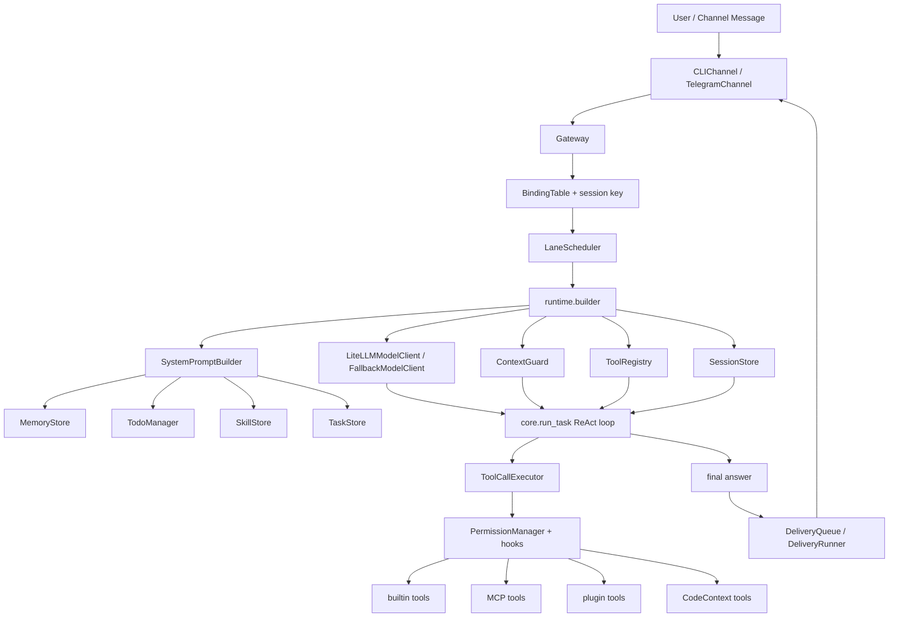
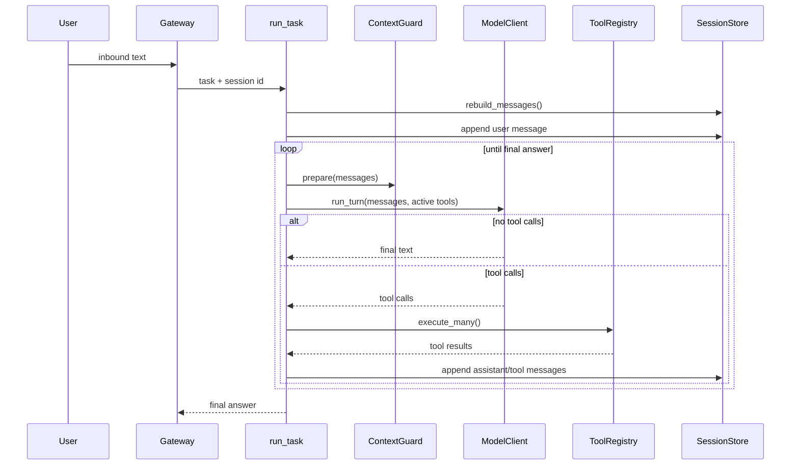
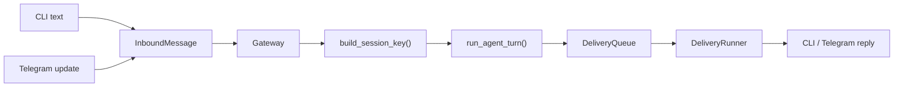

# zx-code

`zx-code` 是一个用 Python 实现的本地 Coding Agent 运行时实验仓库。它不是只包一层模型 API 的 CLI，而是在逐步拆出一个可持久化、可扩展、可接多通道、可接工具和子代理的 Agent Runtime。

## 快速开始

环境要求：

- Python `3.11+`
- [`uv`](https://docs.astral.sh/uv/)

安装依赖：

```bash
uv sync --dev
```

配置模型 key。模型调用经由 LiteLLM，因此 key 取决于实际使用的 provider：

```bash
export OPENAI_API_KEY="your-openai-key"
# 或
export ANTHROPIC_API_KEY="your-anthropic-key"
```

一次性执行：

```bash
uv run agent "总结这个仓库的核心架构"
```

进入 REPL：

```bash
uv run agent
```

常用参数：

```bash
uv run agent --model openai/gpt-4o-mini "读取 README"
uv run agent --no-stream "列出当前项目结构"
uv run agent --max-turns 8 "分析 src/agent/core/loop.py"
uv run agent --resume demo-session "继续上次任务"
uv run agent --print-system-prompt
uv run agent --debug-log --debug-log-path .agent/debug.jsonl "调试一次运行"
```

运行测试：

```bash
uv run pytest -q
```

## 一句话架构

当前运行链路可以压缩成这一条：

```text
CLI / Channel
  -> Gateway
  -> LaneScheduler
  -> runtime builder
  -> core ReAct loop
  -> LiteLLM model client
  -> ToolRegistry
  -> SessionStore / DeliveryQueue
```

更完整的结构如下：



## 核心能力

### Agent Loop

核心文件是 [`src/agent/core/loop.py`](src/agent/core/loop.py)。

主循环做的事情：

1. 从 `SessionStore` 恢复历史消息。
2. 追加本轮用户输入。
3. 通过 `ContextGuard` 准备发给模型的消息副本，必要时裁剪或 compact。
4. 通过 `ResilienceRunner` 调用模型，处理 timeout、rate limit、overflow 等恢复路径。
5. 如果模型没有 tool call，返回最终回答。
6. 如果模型有 tool call，交给 `ToolCallExecutor` 执行。
7. tool result 写回消息历史，再进入下一轮模型调用。



### Tool System

核心文件：

- [`src/agent/tools/registry.py`](src/agent/tools/registry.py)
- [`src/agent/core/tool_executor.py`](src/agent/core/tool_executor.py)
- [`src/agent/permissions.py`](src/agent/permissions.py)
- [`src/agent/tools/tool_search.py`](src/agent/tools/tool_search.py)

`ToolRegistry` 负责注册工具、暴露 schema、执行工具和接入权限系统。工具输入用 Pydantic model 校验，工具输出统一包装成 `ToolResult`。

当前工具 schema 采用按需激活策略：

- prompt 里保留真实工具索引，用于让模型知道有哪些能力。
- 第一轮默认只把 `tool_search` schema 发给模型。
- 模型通过 `tool_search` 搜索工具后，匹配到的工具 schema 会在后续 turn 里激活。
- `active_schemas()` 始终保留 `tool_search`，并返回本轮允许发送给模型的工具集合。

这让系统 prompt 可以保持短一些，同时避免每轮都把所有工具参数 schema 塞给模型。

内置工具按运行时依赖动态注册：

- 基础文件和命令工具：`bash`、`read_file`、`write_file`、`edit_file`、`grep`
- 状态工具：`todo_*`、`memory_append`、`task_*`、`load_skill`
- 子代理工具：`subagent_run`
- worktree 工具：`worktree_create`、`worktree_cleanup`
- CodeContext 工具：`code_index`、`code_search`、`code_index_status`、`code_index_clear`
- 扩展工具：MCP 工具和 plugin 工具

### Prompt, Memory, Todo, Task, Skill

核心文件：

- [`src/agent/prompt.py`](src/agent/prompt.py)
- [`src/agent/state/memory.py`](src/agent/state/memory.py)
- [`src/agent/state/todo.py`](src/agent/state/todo.py)
- [`src/agent/state/tasks.py`](src/agent/state/tasks.py)
- [`src/agent/state/skills.py`](src/agent/state/skills.py)

`SystemPromptBuilder` 是 prompt 的组合点。它会把运行时信息、工具索引、memory、todo、task、skill index 组合进 system prompt。

设计上要区分几类状态：

- `SessionStore`：完整对话历史，用于恢复上下文。
- `MemoryStore`：长期记忆，默认路径 `.memory/MEMORY.md`。
- `TodoManager`：当前 session 的轻量待办状态。
- `TaskStore`：持久化 DAG 任务系统，支持 `blocked_by` 和依赖解锁。
- `SkillStore`：只在 prompt 注入技能索引，完整技能正文通过 `load_skill` 按需读取。

### Context 和 Recovery

核心文件：

- [`src/agent/core/context.py`](src/agent/core/context.py)
- [`src/agent/core/recovery.py`](src/agent/core/recovery.py)
- [`src/agent/errors.py`](src/agent/errors.py)

`ContextGuard` 只处理“发给模型的消息副本”，不直接改真实 session 历史。它的边界是上下文预算、tool result 截断、最近消息保留和 compact。

`ResilienceRunner` 负责单次模型 turn 的失败恢复：

- 模型调用 timeout
- rate limit backoff
- overflow 后 compact 再试
- 截断输出后的 continuation
- 可恢复错误交给 fallback profile

### Multi-channel Runtime

核心文件：

- [`src/agent/channels/base.py`](src/agent/channels/base.py)
- [`src/agent/channels/gateway.py`](src/agent/channels/gateway.py)
- [`src/agent/channels/cli.py`](src/agent/channels/cli.py)
- [`src/agent/channels/telegram.py`](src/agent/channels/telegram.py)
- [`src/agent/channels/delivery.py`](src/agent/channels/delivery.py)

外部入口都会被归一化成 `InboundMessage`。`Gateway` 再根据 channel、account、peer、guild 和 `DMScope` 生成 session key，并把任务交给同一条 Agent loop。



出站消息不直接发送，而是先进入 `DeliveryQueue`：

- `.agent/delivery/queued/`
- `.agent/delivery/sent/`
- `.agent/delivery/failed/`

`DeliveryRunner` 负责发送、重试、指数退避和失败归档。`--watch` 模式下会启动 `DeliveryDaemon` 持续 drain 队列。

### Scheduling, Cron, Heartbeat, Subagent

核心文件：

- [`src/agent/scheduling/lanes.py`](src/agent/scheduling/lanes.py)
- [`src/agent/scheduling/background.py`](src/agent/scheduling/background.py)
- [`src/agent/scheduling/heartbeat.py`](src/agent/scheduling/heartbeat.py)
- [`src/agent/scheduling/cron.py`](src/agent/scheduling/cron.py)
- [`src/agent/agents/subagent.py`](src/agent/agents/subagent.py)

`LaneScheduler` 是协作式优先级调度层，当前优先级是：

```text
main > subagent > cron > heartbeat
```

它解决的问题是：同一个运行时里，用户消息、子代理、定时任务、心跳任务不能完全无序地抢模型和工具资源。

`SubagentRunner` 支持主 Agent 通过 `subagent_run` 把聚焦任务交给子代理执行。子代理使用独立 session，并受递归深度限制。开启 worktree isolation 后，子代理可以配合 `WorktreeManager` 在独立 git worktree 中工作。

### MCP, Plugin, Hooks

核心文件：

- [`src/agent/mcp/client.py`](src/agent/mcp/client.py)
- [`src/agent/mcp/router.py`](src/agent/mcp/router.py)
- [`src/agent/plugins.py`](src/agent/plugins.py)
- [`src/agent/hooks.py`](src/agent/hooks.py)

扩展点分三类：

- MCP：通过官方 `mcp` Python SDK 接 stdio server，发现出的工具注册成 `mcp__server__tool`。
- Plugin：从 `plugin.json` 发现命令型插件工具，注册成 `plugin__plugin__tool`。
- Hooks：支持 `pre_tool_use` 和 `post_tool_use`，可在工具执行前后做策略检查或日志记录。

所有扩展工具最终都进入 `ToolRegistry`，因此复用同一套 schema、权限、执行、debug log 和 tool result 机制。

### CodeContext

核心文件：

- [`src/agent/code_context/indexer.py`](src/agent/code_context/indexer.py)
- [`src/agent/code_context/chroma_store.py`](src/agent/code_context/chroma_store.py)
- [`src/agent/code_context/splitter.py`](src/agent/code_context/splitter.py)
- [`src/agent/code_context/ranker.py`](src/agent/code_context/ranker.py)
- [`src/agent/tools/code_context.py`](src/agent/tools/code_context.py)

CodeContext 是代码库语义上下文层，默认关闭。开启后会注册 `code_index`、`code_search`、`code_index_status`、`code_index_clear`。

实现要点：

- ChromaDB `PersistentClient` 持久化到 `.agent/code-context/chroma`
- collection 内通过 `codebase_id` / `codebase_path` metadata 隔离多个仓库
- Python 文件使用 AST-aware chunking，其他常见代码/文档文件使用 line-based chunking
- 读取 `.gitignore` / `.contextignore`
- 忽略 `.env`、`.git`、`node_modules`、`.agent` 等敏感或低价值路径
- 使用文件级 `sha256` snapshot 支持 added / modified / removed 增量索引
- `code_search` 使用 Chroma vector search、本地 BM25-like 关键词通道和 RRF 融合

## 配置

配置优先级从低到高：

1. 用户级：`~/.zx-code/config.toml`
2. 项目级：`.zx-code/config.toml`
3. CLI 参数

TOML 可以直接写顶级字段，也可以放到 `[agent]` section。推荐用 `[agent]`。

最小配置示例：

```toml
[agent]
model = "openai/gpt-5.4-mini"
fallback_models = "openai/gpt-5.5"
reasoning_effort = "" # 可填 "low"、"medium"、"high"，具体取决于模型和 provider
max_iterations = 30
context_max_tokens = 128000
data_dir = ".agent"
memory_path = ".memory/MEMORY.md"
```

临时开启支持模型的推理强度：

```bash
uv run agent --reasoning-effort medium "分析这个改动的风险"
```

如果使用 `model_profiles`，可以为不同 profile 单独配置：

```toml
[[agent.model_profiles]]
name = "primary"
model = "openai/gpt-5.4-mini"
api_key_env = "OPENAI_API_KEY"
reasoning_effort = "medium"

[[agent.model_profiles]]
name = "backup"
model = "openai/gpt-5.5"
api_key_env = "OPENAI_API_KEY"
reasoning_effort = "high"
```

不支持 `reasoning_effort` 的模型会由 LiteLLM 按其 provider 行为处理；更特殊的 reasoning 参数仍可放进 `extra_kwargs` 透传。

常用功能开关：

```toml
[agent]
enable_memory = true
enable_skills = true
skills_dir = "skills"
enable_todos = true
enable_tasks = true
tasks_dir = ".tasks"
enable_subagents = true
subagent_max_depth = 1
enable_worktree_isolation = false
worktree_dir = ".agent/worktrees"
```

CodeContext：

```toml
[agent]
code_context_enabled = true
code_context_path = ".agent/code-context/chroma"
code_context_snapshot_dir = ".agent/code-context/snapshots"
code_context_collection = "agent_code_context"
code_context_max_result_chars = 4000
code_context_max_total_chars = 12000
```

权限配置可以放在 `.zx-code/permissions.toml`：

```toml
default = "allow"

[tools]
bash = "ask"
write_file = "ask"
edit_file = "ask"

[[rules]]
tool = "bash"
decision = "deny"
pattern = "rm -rf"
```

具体字段以 [`src/agent/config.py`](src/agent/config.py) 和 [`src/agent/permissions.py`](src/agent/permissions.py) 为准。

## CLI 模式

一次性任务：

```bash
uv run agent "帮我看 src/agent/core/loop.py"
```

指定 session：

```bash
uv run agent --resume demo "继续分析"
```

进入 REPL：

```bash
uv run agent
```

REPL 支持：

- `/help`：查看命令
- `/session`：查看当前 session id
- `/clear`：清屏并重绘状态面板
- `exit` / `quit`：退出

退出时会打印恢复命令：

```bash
uv run agent --resume <session-id>
```

## Telegram

Telegram 通道使用 Bot API 的 `getUpdates` 拉取消息，用 `sendMessage` 回复。

配置：

```bash
export TELEGRAM_BOT_TOKEN="your-telegram-bot-token"
```

拉取一条消息并回复：

```bash
uv run agent \
  --channel telegram \
  --telegram-token "$TELEGRAM_BOT_TOKEN" \
  --account-id main-telegram-bot \
  --dm-scope per-account-channel-peer
```

持续监听：

```bash
uv run agent \
  --channel telegram \
  --watch \
  --telegram-token "$TELEGRAM_BOT_TOKEN" \
  --account-id main-telegram-bot \
  --dm-scope per-account-channel-peer
```

常用调试：

```bash
uv run agent \
  --channel telegram \
  --telegram-token "$TELEGRAM_BOT_TOKEN" \
  --telegram-allowed-chats "123456789,-1001234567890" \
  --print-system-prompt
```

Telegram offset 持久化在：

```text
.agent/channels/telegram/offset-<account_id>.txt
```

如果之前配置过 webhook，可以先清掉：

```bash
curl "https://api.telegram.org/bot${TELEGRAM_BOT_TOKEN}/deleteWebhook?drop_pending_updates=true"
```

## Cron 和 Heartbeat

Heartbeat 用于在 watch 模式下主动检查是否需要给用户发更新：

```bash
uv run agent \
  --channel telegram \
  --watch \
  --heartbeat \
  --heartbeat-interval 300 \
  --heartbeat-min-idle 30 \
  --heartbeat-channel telegram \
  --heartbeat-to "<chat-id>" \
  --heartbeat-prompt "检查是否有需要主动同步的任务进展"
```

Cron job 从文件加载：

```bash
uv run agent --watch --cron-jobs .agent/cron-jobs.toml
```

Cron 状态持久化到：

```text
.agent/cron-state.json
```

## Debug Log

开启：

```bash
uv run agent --debug-log --debug-log-path .agent/debug.jsonl "分析一次工具调用"
```

常见事件：

- `runtime.built`
- `run.system_prompt`
- `run.user_message`
- `run.model_input`
- `model.request`
- `model.response.raw`
- `model.response.normalized`
- `tool.start`
- `tool.end`

敏感字段如 `api_key`、`token`、`secret` 会脱敏。

## 项目结构

```text
src/agent/
  main.py                  # Typer CLI 入口
  config.py                # AgentSettings + 三层配置加载
  models.py                # Message / ToolCall / ToolResult / RuntimeConfig
  prompt.py                # SystemPromptBuilder
  providers/               # LiteLLM 模型客户端
  core/                    # ReAct loop、上下文、恢复、工具执行
  tools/                   # 内置工具和 ToolRegistry
  state/                   # session / memory / todo / task / skill
  channels/                # CLI / Telegram / Gateway / Delivery
  scheduling/              # lanes / background / heartbeat / cron
  agents/                  # subagent / team / worktree
  mcp/                     # stdio MCP client 和工具路由
  code_context/            # 代码库索引和搜索
  runtime/                 # runtime 装配与运行模式
  plugins.py               # plugin.json 命令型插件加载
  hooks.py                 # tool hook
tests/                     # 单元测试和集成式回归测试
interview/                 # 面试讲解材料
docs/                      # 设计和阶段文档
```

## 阅读顺序

如果是第一次看这个仓库，建议按这个顺序：

1. [`src/agent/main.py`](src/agent/main.py)：CLI 参数如何进入配置。
2. [`src/agent/runtime/runner.py`](src/agent/runtime/runner.py)：一次性任务、REPL、channel watch 怎么分流。
3. [`src/agent/runtime/builder.py`](src/agent/runtime/builder.py)：运行时对象如何装配。
4. [`src/agent/channels/gateway.py`](src/agent/channels/gateway.py)：多通道如何统一成 session。
5. [`src/agent/core/loop.py`](src/agent/core/loop.py)：Agent ReAct loop。
6. [`src/agent/tools/registry.py`](src/agent/tools/registry.py)：工具注册、schema、执行和权限入口。
7. [`src/agent/core/context.py`](src/agent/core/context.py)：上下文预算和 compact 边界。
8. [`src/agent/core/recovery.py`](src/agent/core/recovery.py)：模型失败恢复。
9. [`src/agent/prompt.py`](src/agent/prompt.py)：prompt 如何组合 memory、todo、skill、task、tool index。
10. [`src/agent/code_context/indexer.py`](src/agent/code_context/indexer.py)：CodeContext 如何索引代码库。

面试材料从 [`interview/README.md`](interview/README.md) 开始。

## 当前边界

这个项目已经覆盖了一个本地 Agent Runtime 的主要骨架，但仍有一些明确边界：

- CLI 当前主要是文本入口，不是完整多模态输入链路。
- CodeContext 默认关闭，需要配置开启。
- Subagent 是本地运行时内的子任务执行，不是分布式 agent cluster。
- Worktree isolation 需要显式开启。
- MCP 和 plugin 是工具扩展机制，不等于完整 marketplace 或远程 sandbox。
- Agent Teams 相关代码仍偏实验性质，主线能力还是 single-agent runtime + subagent。

## 开发约定

常用验证：

```bash
uv run pytest -q
```

针对性验证：

```bash
uv run pytest -q tests/test_loop.py tests/test_tools.py
uv run pytest -q tests/test_gateway.py tests/test_delivery.py
uv run pytest -q tests/test_code_context_indexer.py tests/test_code_context_tools.py
```
