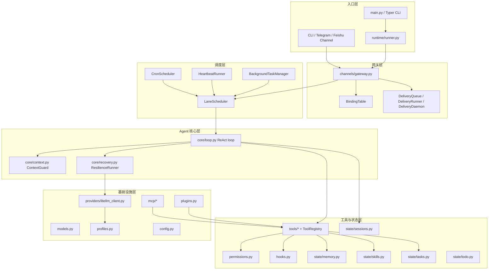
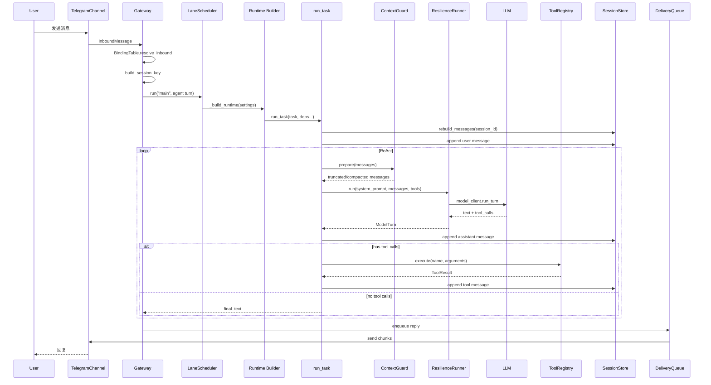
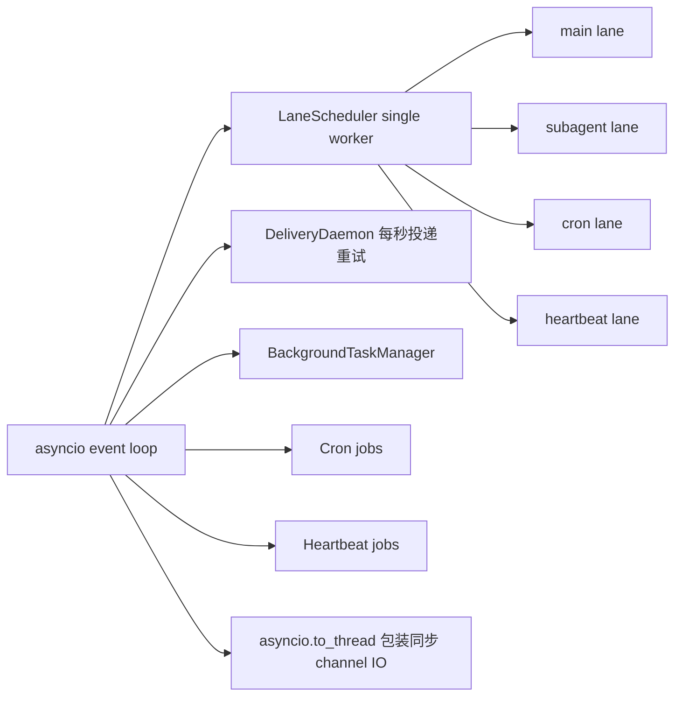

# 01 - 项目总览与数据流

## 1. 项目定位

这个项目是一个本地 Coding Agent 框架。它不是调用一次大模型的 CLI，而是一个完整的 Agent Runtime：

- LLM 负责推理和决定是否调用工具。
- Tool Registry 负责把读写文件、执行命令、搜索代码、记忆、任务、子代理、MCP 等能力暴露给模型。
- ContextGuard 负责上下文预算和压缩。
- SessionStore 负责跨重启历史恢复。
- PermissionManager 和 HookRunner 负责安全审批和扩展。
- Gateway、Channel、DeliveryQueue 负责把 Agent 从本地 CLI 扩展到 Telegram/飞书等外部入口。
- LaneScheduler、Cron、Heartbeat、Subagent、Team 负责主动任务、多代理和并发调度。

一句话：这是一个从 Agent Loop 到运行时平台的最小生产化实现。

## 2. 分层架构



### 面试表达

我把系统拆成六层。最核心是 `core/loop.py` 的 ReAct 循环，它只关心“消息、模型、工具、上下文、会话”，不直接依赖 Telegram、飞书或 CLI。外部入口通过 Gateway 归一化成 `InboundMessage`，再通过运行时 builder 组装 Agent 依赖。这样核心 Agent 可以被 CLI、网关、Cron、Heartbeat、Subagent 复用。

这个设计的关键不是文件夹分层，而是依赖方向：入口依赖运行时，运行时依赖 core，core 依赖抽象的 model client 和 tool registry。通道层不会污染 Agent 核心。

## 3. 一条消息的完整生命周期

以 Telegram 用户发来“帮我重构这个函数”为例：



## 4. Composition Root 为什么重要

`src/agent/runtime/builder.py` 是组合根。它按依赖顺序创建所有组件：

```text
MemoryStore
  -> TodoManager / SkillStore / TaskStore
  -> SystemPromptBuilder
  -> PermissionManager
  -> SubagentRunner
  -> WorktreeManager
  -> ToolRegistry
  -> PluginManager 动态注册插件工具
  -> HookRunner
  -> ContextGuard
  -> ModelClient / FallbackModelClient
  -> SessionStore
```

### 为什么不在各模块里自己 new 依赖

如果 `loop.py` 自己创建 `LiteLLMModelClient`、`SessionStore`、`PermissionManager`，测试和扩展会非常困难。现在 `run_task()` 接收依赖参数：

- 测试时可以传 mock model client。
- CLI 和 Gateway 可以复用同一个 Agent 核心。
- 子代理可以通过闭包递归调用 `_run_agent_text()`，但用独立 session id。
- MCP 工具可以运行时注册到同一个 registry，再刷新 system prompt。

面试官如果追问“你如何保证模块可测试”，可以直接指向这个设计。

## 5. 核心数据模型

本项目使用 Pydantic v2 定义数据契约，典型模型包括：

```text
Message
  role: user | assistant | tool | system
  content: str
  tool_calls: list[ToolCall]
  tool_call_id/name: tool 消息关联字段

ToolCall
  id: str
  name: str
  arguments: dict

ToolResult
  call_id: str
  name: str
  content: str
  is_error: bool

ModelTurn
  text: str
  tool_calls: list[ToolCall]
  stop_reason: str

AgentRunResult
  final_text: str
  iterations: int
  messages: list[Message]
  tool_results: list[ToolResult]
  session_id: str

InboundMessage
  channel/account_id/guild_id/peer_id/text

DeliveryEntry
  id/channel/to/text/status/retry_count/next_retry_at
```

面试亮点：Pydantic 不只是“类型好看”，它同时承担：

- 参数验证。
- JSON 序列化和反序列化。
- Tool schema 自动生成。
- 配置解析。
- 防止工具调用参数错导致主循环崩溃。

## 6. 并发模型

项目采用 `asyncio` 协作式并发：



### 面试表达

我没有用多线程来并行跑多个 Agent turn，而是用 `LaneScheduler` 管控所有 LLM turn。这样可以避免同一个用户连续消息乱序，也能让主对话优先于子代理、Cron 和 Heartbeat。外部通道里必须阻塞的部分，例如标准库 `urllib.request`，用 `asyncio.to_thread()` 包起来，避免阻塞事件循环。

## 7. 项目的工程取舍

| 主题 | 我的选择 | 原因 |
|---|---|---|
| 语言 | Python | 更适合快速展示 Agent 原理和工程模块 |
| 并发 | asyncio | 标准库、低依赖、适合 IO 密集型 LLM 调用 |
| 模型层 | litellm | 供应商无关，一套 tool call 适配多个模型 |
| 数据模型 | Pydantic v2 | 验证、schema、序列化一体化 |
| 持久化 | 文件系统 JSONL/JSON/Markdown | 人类可读、零数据库依赖、适合单机 Coding Agent |
| 安全 | 权限规则 + ask/deny + hooks | 教学项目不实现 OS 沙箱，但保留审批和扩展点 |
| 扩展 | Tools + Skills + MCP + Plugins | 覆盖本地工具、按需文档、外部协议、命令型插件 |

## 8. 该项目边界

需要诚实说明：

- 本项目不是企业多租户服务，不处理大规模并发和分布式一致性。
- 没有 Codex 那种 OS 级 Seatbelt/Landlock 沙箱。
- 没有 Claude Code 那种完整 React Ink TUI。
- 记忆搜索目前更偏轻量文件搜索，不是大型向量数据库。

但这些不是弱点，而是面试时的取舍点：本项目目标是把生产级 Coding Agent 的核心机制拆开、实现、讲清楚。对于单机本地 Agent，这种文件系统 + asyncio + Pydantic 的组合已经足够落地。

