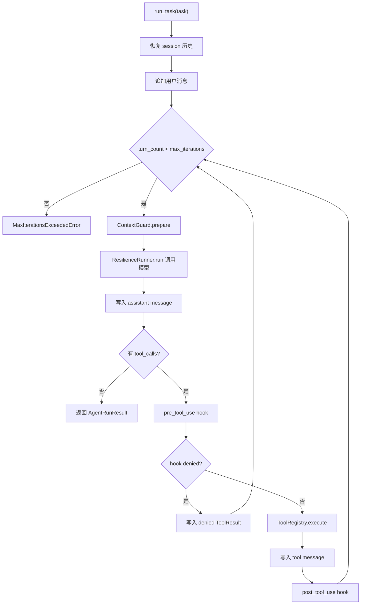
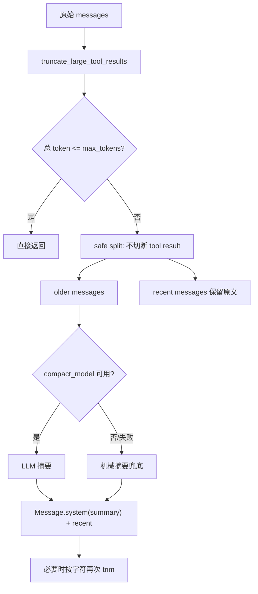
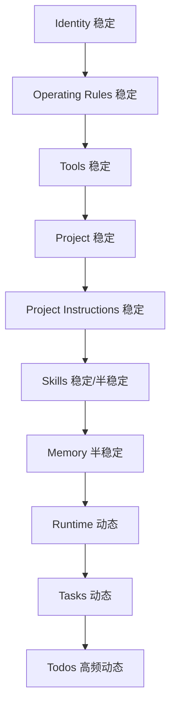
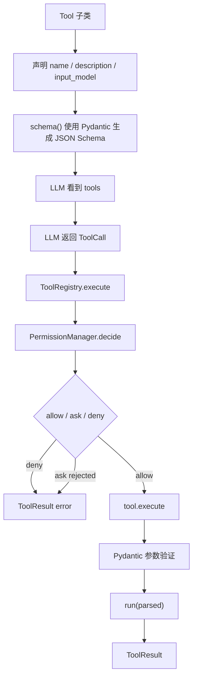
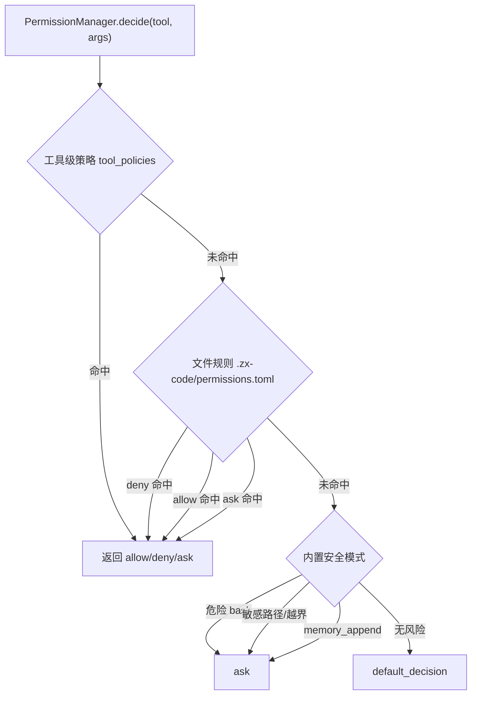
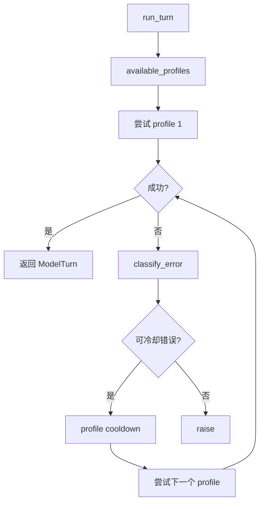
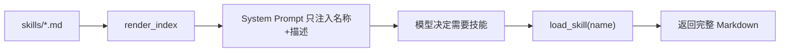
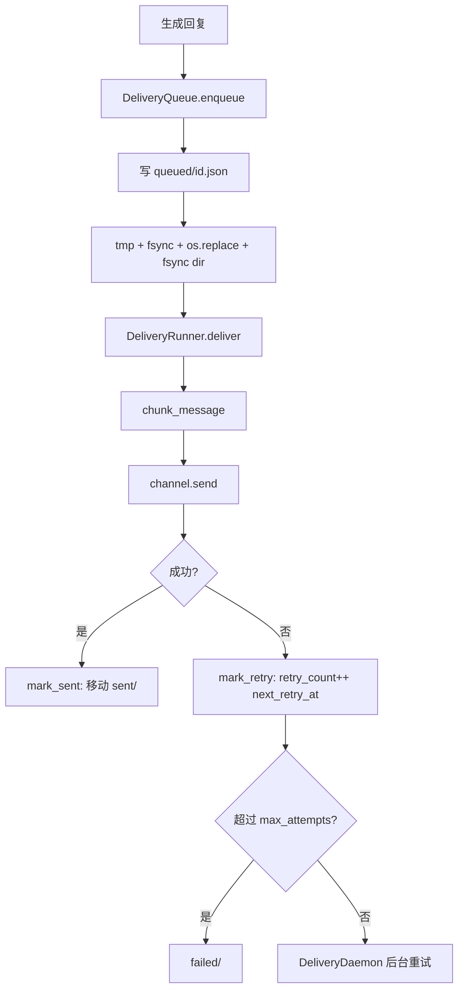
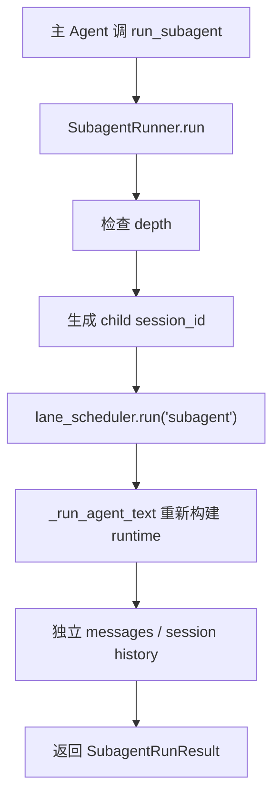
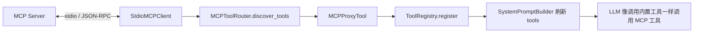

# 02 - 核心模块逐个击破

## 模块 1：ReAct 主循环

关键源码：`src/agent/core/loop.py`

### 解决什么问题

LLM 本身只能根据上下文生成下一段文本。Coding Agent 要完成“读代码、改代码、运行测试、修复错误”这类任务，必须让模型可以：

1. 看到当前任务和历史上下文。
2. 决定是否调用工具。
3. 工具执行后把结果写回上下文。
4. 继续推理，直到没有工具调用。

这就是 ReAct：Reason + Act。

### 本项目实现



### 关键代码逻辑

`run_task()` 的主体非常清晰：

```python
while state.turn_count < state.max_iterations:
    state.turn_count += 1
    model_messages = await context_guard.prepare(state.messages)
    turn = await ResilienceRunner(...).run(
        system_prompt=state.system_prompt,
        messages=model_messages,
        tools=tool_registry.schemas(),
    )
    state.messages.append(Message.assistant(turn.text, turn.tool_calls))

    if not turn.tool_calls:
        return AgentRunResult(...)

    for call in turn.tool_calls:
        hook_result = await hooks.run("pre_tool_use", payload)
        result = await tool_registry.execute(call.name, call.arguments, call_id=call.id)
        state.messages.append(result.to_message())
```

### 为什么这样设计

| 方案 | 优点 | 缺点 | 本项目选择 |
|---|---|---|---|
| 同步 while loop | 最简单 | 无法后台任务、无法优雅处理外部通道 | 不选 |
| async generator | 事件流漂亮，像 Claude Code | Python 中异常和状态调试更复杂 | 不选 |
| async while + await | 清晰、可测试、能接入异步 IO | UI 事件流不如 generator 自然 | 选择 |

### 面试追问

**Q：为什么要有最大迭代数？**

防止模型陷入无限工具调用。例如 grep 找不到文件后反复 grep，或者 edit 失败后反复尝试。`max_iterations` 是运行时安全阀。

**Q：工具失败会不会让主循环崩溃？**

不会。工具系统会把参数错误、权限拒绝、执行异常都包装为 `ToolResult(is_error=True)`，作为 tool message 回写给模型，让模型决定下一步。

**Q：为什么 hooks 放在 loop 而不是 tool registry？**

权限属于工具执行前的强约束，放 registry。Hook 是运行时生命周期扩展，需要拿到 session_id、工具结果、事件类型，所以放在 loop 周围更自然。

## 模块 2：上下文管理

关键源码：`src/agent/core/context.py`

### 解决什么问题

上下文窗口是 Agent 的硬约束。长对话和大工具输出会导致：

- 请求超过模型 token limit。
- 成本急剧上升。
- 模型被旧信息干扰。
- tool call 与 tool result 被截断后形成非法消息序列。

### 本项目两阶段策略



### 实现细节

- `tool_result_max_chars=6000`：单条工具结果太大时先截断。
- `max_tokens=12000`：超过 token budget 才进行历史压缩。
- `keep_recent=6`：保留最近 6 条消息原文。
- `_safe_split_index()`：如果切分点落在 tool message 上，往后移动，避免 assistant tool call 和 tool result 被拆开。
- `_llm_summarize()`：使用 `compact_model` 调 litellm 生成摘要。
- `_mechanical_summary()`：LLM 摘要失败时的兜底。

### 为什么保留最近消息

最近几轮通常包含：

- 刚读到的源码片段。
- 刚失败的测试输出。
- 刚执行的 edit 结果。
- 模型下一步要继续处理的局部状态。

如果把最近历史也摘要掉，模型容易重复读文件、重复运行命令，或者忘记刚才失败的具体错误。

### 面试追问

**Q：为什么不把所有历史都总结成一条摘要？**

摘要会丢失细节，尤其是工具输出和错误栈。远历史可以摘要，近历史必须保留原文，这是继续任务质量的关键。

**Q：token 计数为什么不用简单 len？**

本项目优先使用 `litellm.token_counter()`，它能按模型选择 tokenizer；不可用时才降级为 `len(text)//3+1`。这样在多模型场景下比字符估算更稳。

**Q：compact 后 source of truth 是什么？**

摘要只是连续性提示。代码文件、测试输出、当前工具结果才是事实来源。文档里也明确提示 “source files and tool outputs remain the source of truth”。

## 模块 3：System Prompt 组装

关键源码：`src/agent/prompt.py`

### 解决什么问题

System prompt 不是一段越写越长的字符串，而是运行时上下文的组装管线。它需要同时包含：

- Agent 身份。
- 行为规则。
- 工具索引。
- 项目说明。
- 项目指令。
- 技能索引。
- 记忆索引。
- 当前日期、模型、session id。
- 持久任务和 todos。

### 本项目 section 顺序



### 为什么稳定内容放前面

很多 LLM API 支持 prompt prefix cache。稳定 section 放前面，可以提高缓存命中率：

- 身份、规则、工具、项目说明变化少，放前面。
- Runtime、Tasks、Todos 每轮变化，放后面。

这是工程化 prompt 设计，而不是普通 prompt 拼接。

### 面试追问

**Q：工具 schema 已经传给模型了，为什么 prompt 还要有工具索引？**

工具 schema 是机器可读的参数定义；prompt 中的工具索引是人类/模型更容易浏览的能力目录。模型在规划时先看索引，在调用时再按 schema 传参。

**Q：为什么 Skills 只放索引，不放全文？**

技能 Markdown 可能很长，不应该每次消耗 token。Prompt 只注入名称和描述，模型需要时通过 `load_skill` 工具按需读取全文。

## 模块 4：记忆系统

关键源码：`src/agent/state/memory.py`、`src/agent/tools/memory.py`

### 解决什么问题

会话历史解决的是“当前 session 发生了什么”；记忆系统解决的是“跨 session 需要长期保留什么”。

典型记忆：

- 用户偏好：喜欢 pytest，不喜欢 mock 数据库。
- 项目规则：某个目录不要改。
- 历史反馈：回答要直接给命令。
- 外部引用：Issue tracker、部署地址、设计文档路径。

### 存储格式

本项目使用 Markdown + YAML frontmatter：

```markdown
---
name: user_testing_preference
description: 用户偏好真实集成测试
type: feedback
updated_at: 2026-05-08T10:00:00+00:00
---

用户要求数据库相关测试优先使用真实连接，不要默认 mock。
```

主索引是 `.memory/MEMORY.md`，单条结构化记忆可以保存为 `.memory/<name>.md`，并追加索引链接。

### 为什么用文件而不是数据库

| 方案 | 优点 | 缺点 | 本项目选择 |
|---|---|---|---|
| SQLite | 查询强、事务强 | 需要 schema、查看不如 Markdown 直观 | 不选 |
| 向量库 | 语义搜索强 | 依赖重，小规模过度工程 | 不选 |
| Markdown 文件 | 人类可读、可 git 管理、零服务依赖 | 大规模查询弱 | 选择 |

### Prompt 注入

`SystemPromptBuilder._memory_block()` 会调用 `memory_store.render_for_prompt()`，最多注入 4000 字符，并说明：

```text
Memory contains user preferences and durable project notes.
It must not override source code, tests, or current tool results.
```

这个约束很重要：记忆不能覆盖当前代码和工具结果。

### 面试追问

**Q：怎么避免记忆污染？**

本项目把记忆定位为 durable notes，而不是事实数据库。Prompt 明确要求 source code/tests/tool results 优先。并且 `memory_append` 默认需要权限审批，避免模型随意写长期记忆。

**Q：记忆文件越来越大怎么办？**

当前通过 prompt 注入上限控制 token。进一步可以用 Cron 定期压缩 MEMORY.md，或者把旧记忆转成结构化记录，索引只保留摘要。

## 模块 5：工具系统

关键源码：`src/agent/tools/base.py`、`src/agent/tools/registry.py`

### 解决什么问题

模型要调用外部能力，必须有统一协议：

- 工具名字和描述。
- 参数 schema。
- 参数验证。
- 权限检查。
- 错误包装。
- 结果回写。

### 本项目工具抽象



### 关键设计

`Tool.schema()`：

```python
return {
    "type": "function",
    "function": {
        "name": self.name,
        "description": self.description,
        "parameters": self.input_model.model_json_schema(),
    },
}
```

这让新增工具的成本很低：定义一个 Pydantic input model，再实现 `run()`。

### 面试追问

**Q：为什么不用简单 dict 映射函数？**

dict 映射只能执行函数，不能天然提供 JSON Schema、参数验证、描述、权限和并发安全标识。Pydantic Tool 类把“给模型看的接口”和“运行时执行接口”统一起来。

**Q：工具异常为什么不直接 raise？**

工具失败是 Agent 正常工作的一部分。比如测试失败、文件不存在、权限被拒绝，都应该返回给模型继续推理，而不是让整个 Agent 崩溃。

## 模块 6：权限系统

关键源码：`src/agent/permissions.py`

### 解决什么问题

Coding Agent 会执行命令和写文件。如果完全信任模型，风险很高：

- `rm -rf`、`sudo`、`chmod 777`。
- 写入 `.env`、私钥、系统目录。
- 跳出工作目录修改用户文件。
- 自动写长期记忆。

### 三层规则



### 为什么是 allow/deny/ask 三态

- `allow`：低风险操作直接执行。
- `deny`：确定不能做，例如配置禁止某工具。
- `ask`：风险不确定，需要用户审批。

这比二态权限更适合 Coding Agent，因为大量操作不是绝对安全或危险，而是“需要确认”。

### 面试追问

**Q：这和 Codex 的沙箱比差在哪？**

Codex 有 OS 级沙箱，能从系统层面限制文件和网络访问。本项目是应用层权限，能阻止大部分明显危险操作，但不能替代 OS 沙箱。选择应用层是因为项目目标是教学和单机原型，优先实现机制可解释性。

## 模块 7：错误恢复

关键源码：`src/agent/core/recovery.py`、`src/agent/profiles.py`

### 解决什么问题

LLM 调用常见失败：

- 限流。
- 上下文超限。
- 输出被截断。
- 超时。
- 认证失败。
- 余额不足。

不同错误不能用同一种 retry。

### ResilienceRunner 策略

| 错误类型 | 检测方式 | 恢复策略 |
|---|---|---|
| `rate_limit` | 429 / rate limit 文本 | 指数退避后重试 |
| `overflow` | context length / token limit | 调 ContextGuard.compact_history 后重试 |
| `max_tokens` | stop_reason length/max_tokens | 追加“请继续”消息 |
| `timeout` | TimeoutError / timeout 文本 | 抛 ModelTimeoutError |
| `auth` | 401/auth/permission | 不在 ResilienceRunner 重试 |
| `billing` | billing/quota/credit | 不在 ResilienceRunner 重试 |

`RecoveryBudget` 对 continuation、compaction、backoff 分别计数，避免无限恢复。

### FallbackModelClient

`profiles.py` 解决多 profile 切换：



### 面试追问

**Q：为什么 `classify_error()` 用字符串匹配？**

因为 litellm 封装很多供应商，异常类不统一。错误消息中的 `429`、`context_length`、`billing` 等关键词更稳定。这里是供应商无关架构的现实取舍。

## 模块 8：会话持久化

关键源码：`src/agent/state/sessions.py`

### 解决什么问题

Agent 需要跨进程恢复：

- 用户中断后继续上次任务。
- Gateway 为不同用户隔离历史。
- 子代理有独立历史。
- Cron/Heartbeat 可以有独立 session。

### 实现

每个 session 一个 JSONL 文件：

```text
.agent/sessions/<safe_session_id>.jsonl
```

每行是一个 `SessionRecord`，其中 `type="message"` 的记录可以 rebuild 成 `Message`。

写入时使用 `fcntl.flock` 加排他锁，降低并发追加互相覆盖的风险。

### 面试追问

**Q：为什么 JSONL 而不是一个大 JSON？**

JSONL 适合 append-only 历史。每轮只追加一行，不需要读出整个文件再写回。进程崩溃时，最多损坏最后一行，也更容易定位。

## 模块 9：任务、Todo 与 Skill

关键源码：`src/agent/state/tasks.py`、`src/agent/state/todo.py`、`src/agent/state/skills.py`

### TaskStore

TaskStore 是文件持久化 DAG：

- 每个任务一个 `.json` 文件。
- `blocked_by` 表示依赖。
- `complete()` 完成任务后扫描下游，依赖满足就从 blocked 变 pending。
- `render_for_prompt()` 把任务状态注入 prompt。

适合跨 compact、跨重启、跨子代理交接任务状态。

### TodoManager

Todo 更轻量，适合当前 session 内的步骤管理。面试中可以说：

- Todo 是短期执行计划。
- Task 是持久 DAG 任务系统。

### SkillStore

SkillStore 是两层加载：



### 面试追问

**Q：Skill 和 Memory 区别？**

Memory 是用户偏好和项目事实；Skill 是可执行工作流或领域方法。Memory 告诉 Agent “要记住什么”，Skill 告诉 Agent “遇到某类任务怎么做”。

## 模块 10：Gateway 与多通道

关键源码：`src/agent/channels/base.py`、`src/agent/channels/gateway.py`

### 解决什么问题

CLI 只能本地一次输入。真实 Agent 需要接收多个入口：

- CLI。
- Telegram。
- 飞书。
- 未来可能是 Slack、Web、GitHub。

Gateway 把平台消息统一成 `InboundMessage`，再处理路由、会话隔离和回复投递。

### BindingTable

BindingTable 支持按 channel/account_id/guild_id/peer_id 匹配 agent，评分规则：

- `peer_id` 权重最高。
- `guild_id` 次之。
- `account_id` 再次。
- `channel` 最低。
- `force=True` 有最高优先级。

这样既能默认路由，也能把某个群、某个用户绑定到特定 agent。

### DMScope 会话隔离

`build_session_key()` 支持：

- `per-account-channel-peer`
- `per-channel-peer`
- `per-peer`
- `global`

面试表达：同一个 Telegram 用户、飞书用户、群聊上下文是否共享，是一个产品决策，所以做成配置。

## 模块 11：可靠投递

关键源码：`src/agent/channels/delivery.py`

### 解决什么问题

Agent 生成回复之后，外部平台发送可能失败：

- 网络中断。
- Telegram/飞书 API 限流。
- 消息太长。
- 进程发送中途崩溃。

如果只 `await channel.send()`，失败就丢消息。

### WAL 思想



### 面试追问

**Q：这能保证 exactly-once 吗？**

不能。外部平台 API 通常不支持事务。这里保证的是“尽量不丢”和“失败可恢复”。如果 API 调用成功但进程在 mark_sent 前崩溃，可能重发。要 exactly-once 需要平台侧幂等 key 或去重机制。

这个回答很重要，说明你知道分布式系统边界。

## 模块 12：LaneScheduler

关键源码：`src/agent/scheduling/lanes.py`

### 解决什么问题

多个任务同时想调用 LLM：

- 用户主对话。
- 子代理。
- Cron。
- Heartbeat。

如果直接并发，容易出现：

- 同一用户消息乱序。
- 心跳抢占用户对话。
- 子代理和主代理互相等待死锁。

### 优先级

```text
main=0 > subagent=10 > cron=20 > heartbeat=30
```

数字越小优先级越高。

### ContextVar 防死锁

`LaneScheduler.run()` 如果发现当前已经在自己的 worker 里，会直接内联执行，而不是再次入队。

否则会出现：

```text
worker 正在执行主 agent
  主 agent 调 subagent
    subagent 入队等待 worker
worker 等 subagent 返回
=> worker 等自己，死锁
```

### 面试追问

**Q：单 worker 是否限制吞吐？**

是，这是有意取舍。Coding Agent 的主要瓶颈是 LLM 调用和工具副作用，单 worker 能保证顺序和安全。未来如果需要多用户高吞吐，可以按用户或 channel 分片多个 scheduler。

## 模块 13：Subagent 与 Team

关键源码：`src/agent/agents/subagent.py`、`src/agent/agents/team.py`

### Subagent

SubagentRunner 的核心：

- 子代理生成独立 `session_id`。
- 通过 `_run_agent_text()` 重新构建 runtime。
- `current_depth + 1` 防止递归无限嵌套。
- 有 LaneScheduler 时走 `subagent` lane。



### Team

Team 是更通用的多 Agent 协作：

- `MessageBus` 用 `asyncio.Queue` 给每个成员分发消息。
- `request()` 创建 Future，以 message id 做 pending key。
- `respond()` 带 `reply_to`，直接 resolve Future。
- JSONL 日志持久化消息。

关键点：response 不走普通队列，而是直接 resolve Future，避免请求方收到无关广播。

### 面试追问

**Q：Subagent 和 Team 区别？**

Subagent 是主代理临时委派一个任务，结果回到主代理。Team 是多个长期 agent 成员之间的消息总线，支持 request/response/broadcast。

## 模块 14：MCP 与插件

关键源码：`src/agent/mcp/router.py`、`src/agent/mcp/client.py`、`src/agent/plugins.py`

### MCP

MCP 是外部工具协议。项目中的适配方式：



工具命名格式：

```text
mcp__<server_name>__<tool_name>
```

### 插件

插件系统支持从 `plugin.json` 发现命令型插件工具，注册成：

```text
plugin__<plugin>__<tool>
```

MCP 更适合标准协议工具生态，插件更适合本项目本地命令扩展。

### 面试追问

**Q：MCP 工具和内置工具如何统一权限？**

MCPProxyTool 注册到 ToolRegistry 后，正常走 registry 的权限检查、approval callback 和错误包装。Router 里也有权限兜底，防止绕过 registry 直接调用。

## 模块 15：Worktree 隔离

关键源码：`src/agent/agents/worktree.py`、`src/agent/tools/worktree.py`

### 解决什么问题

多个 agent 或子任务同时改同一个仓库，容易互相覆盖。Worktree 隔离允许按任务创建独立 git worktree 和 branch。

面试表达：

- 主仓库保持稳定。
- 子代理可以在隔离目录修改。
- 最后人工 review/merge。
- 这是从“Agent 能改代码”走向“Agent 能安全并行改代码”的关键能力。

