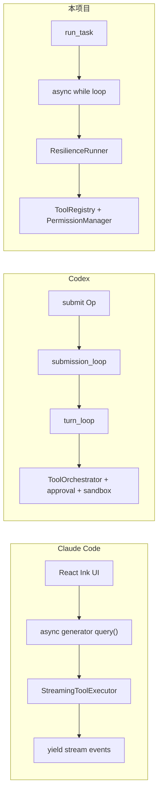
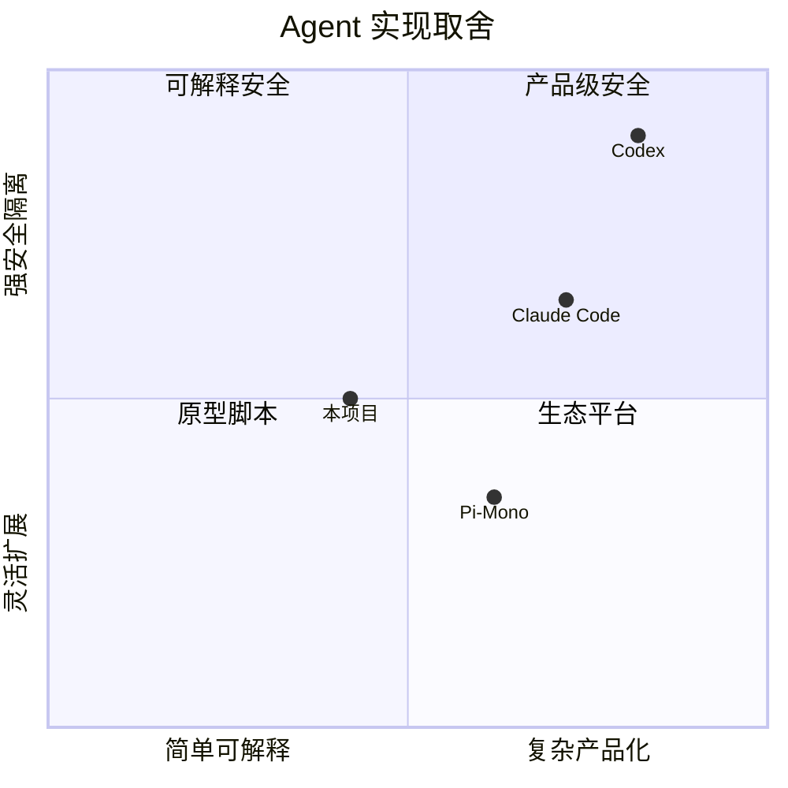

# 03 - Claude Code、Codex 与本项目横向对比

## 1. 总体定位对比

| 维度 | Claude Code | OpenAI Codex CLI | 本项目 |
|---|---|---|---|
| 核心定位 | 交互式 Claude 编程助手 | 安全优先的本地/云端 coding agent | 教学可解释的本地 Agent Runtime |
| 语言 | TypeScript + React Ink | Rust 核心 + TS/CLI 外壳 | Python 3.11+ |
| 模型绑定 | Claude 系列 | OpenAI 模型/Responses API | litellm，多供应商 |
| 架构风格 | 流式交互 + 权限 + MCP/Skills | 事件驱动 + 审批 + OS 沙箱 | async ReAct loop + 文件持久化 + 可插拔工具 |
| 安全重点 | 细粒度权限、hook、工具分类 | OS 沙箱、审批流、策略引擎 | 应用层 allow/deny/ask + hooks |
| 扩展方式 | Skills、Hooks、MCP、Plugins | Skills、MCP、配置 | Tools、Skills、MCP、Plugins |
| 持久化 | 项目/用户状态、记忆、会话 | SQLite/rollout 等 | JSONL/JSON/Markdown 文件 |

## 2. 核心循环对比

| 问题 | Claude Code | Codex | 本项目 |
|---|---|---|---|
| 谁驱动循环 | UI/QueryEngine 消费 async generator | Submission loop 消费 Op | `run_task()` async while |
| 流式输出 | 一等公民，事件不断 yield | 事件流推给客户端 | litellm stream handler |
| 工具执行 | StreamingToolExecutor，可分类并发 | ToolOrchestrator，审批+沙箱 | ToolRegistry，串行执行+权限 |
| 中断/审批 | 与 UI 状态深度集成 | Op 枚举统一处理审批/中断 | 当前偏简化，approval callback |

### 为什么本项目不用 Codex 的 Submission-Event

Codex 的 `submission_loop` 很适合产品级客户端：用户输入、审批结果、中断、配置更新都变成 Op 进入同一个事件循环。但本项目主要目标是讲清 Agent 核心机制，所以选择更直观的 `run_task()`。它更容易测试，也更容易让面试官快速看到 ReAct 本质。

### 为什么本项目不用 Claude Code 的 async generator

Claude Code 需要把流式 UI、工具状态、权限提示、用户交互都作为事件渲染到终端 UI。Python 项目没有复杂 TUI，直接 `async while + await` 更清晰。需要流式输出时，通过 `stream_handler` 处理即可。

## 3. 上下文管理对比

| 维度 | Claude Code | Codex | 本项目 |
|---|---|---|---|
| 触发 | token 接近上限、手动 compact、运行时策略 | context overflow 或 compact 机制 | `ContextGuard.prepare()` 每轮检查 |
| 策略 | 保留系统信息和近期上下文，总结中间历史 | compact + 可能提取长期 memory | 截断大 tool result + LLM 摘要旧历史 + 保留最近 6 条 |
| 重点 | 不中断交互体验，保留任务连续性 | 和会话/记忆结合 | 简洁可解释，避免非法 tool message 切分 |
| 兜底 | 产品级 token 预算管理 | 更完整的上下文服务 | LLM 摘要失败则机械摘要 |

### 本项目为什么这样选

本项目的上下文管理目标是“面试能讲清楚、代码能跑、风险可控”：

- 单条工具结果截断是最常见、收益最高的保护。
- 历史 compact 只在超预算时触发，避免每轮都花钱总结。
- 保留近 6 条消息是对 Coding Agent 很关键的经验：刚读的文件和刚失败的测试不能只留摘要。
- `_safe_split_index` 是细节亮点：避免 assistant tool call 和 tool result 被拆开。

## 4. 记忆系统对比

| 维度 | Claude Code | Codex | 本项目 |
|---|---|---|---|
| 记忆类型 | user/feedback/project/reference | memories 模块，和 compact 结合 | user/feedback/project/reference |
| 存储 | Markdown/frontmatter 风格，项目级 | 更偏内部持久存储 | Markdown + YAML frontmatter |
| 写入方式 | 模型可通过文件工具维护 | compact 时提取/合并 | `memory_append` / `save_record`，默认 ask |
| 注入 | MEMORY 索引进入 prompt | context 构建时注入 | `SystemPromptBuilder._memory_block` |

### 为什么选择 Markdown 文件

Claude Code 的记忆设计很适合本地 Coding Agent：可读、可编辑、可 version control。本项目没有照搬“自动提取记忆”，因为自动记忆很容易污染长期上下文。选择显式写入 + 权限审批，更适合面试项目：可解释、可控。

## 5. Prompt 组装对比

| 维度 | Claude Code | Codex | 本项目 |
|---|---|---|---|
| 基础身份 | 内置大型系统提示 | base/developer instructions | Identity + Operating Rules |
| 项目指令 | CLAUDE.md 链 | developer/project instructions | CLAUDE.md + workspace files |
| 工具 | 工具 schema + 使用规则 | 工具 schema + policy | schema + prompt 工具索引 |
| 技能 | Skills 按需加载 | Skills/MCP | Skill index + load_skill |
| 动态上下文 | UI 状态、todo、runtime | session context | Runtime/Tasks/Todos |
| 顺序策略 | 产品级 prompt pipeline | 强策略约束 | 稳定到动态，优化 cache |

### 本项目的亮点

`SystemPromptBuilder.sections()` 把 prompt 拆成明确 section，并按 cache 友好顺序排列。这比简单字符串拼接更工程化。面试时可以强调：

- prompt 是运行时产物。
- prompt 内容有稳定性分层。
- 高频变化内容放后面，减少缓存失效。

## 6. 工具系统对比

| 维度 | Claude Code | Codex | 本项目 |
|---|---|---|---|
| 工具数量 | 很多内置工具，读写、bash、MCP 等 | 30+ handler | 读写编辑 grep bash memory skill task todo subagent worktree MCP plugin |
| 参数定义 | TS schema/内部类型 | Rust 类型和 handler | Pydantic model_json_schema |
| 权限 | 7 层权限源、交互审批 | approval + sandbox + policy | PermissionManager + approval callback |
| 并发 | 读/写工具分类执行 | orchestrator 管理 | 当前主要串行，保留 `is_concurrency_safe` |

### 本项目为什么用 Pydantic Tool

Python 中 Pydantic 是工具 schema 的最短路径：

- 模型给 LLM 的 tool schema 自动生成。
- LLM 返回参数自动验证。
- 错误可以结构化返回。
- 新增工具只需要一个 input model 和 `run()`。

这比手写 JSON Schema 更不容易出错。

## 7. 权限与沙箱对比

| 维度 | Claude Code | Codex | 本项目 |
|---|---|---|---|
| 安全层级 | 应用层权限 + hooks | OS 沙箱 + 审批 + 策略 | 应用层权限 + hooks |
| 文件隔离 | 工具级路径规则 | Seatbelt/Landlock 等 | 工作目录/敏感路径检查 |
| 命令安全 | Bash 权限与分类 | exec policy + sandbox | dangerous bash regex -> ask |
| 用户审批 | 深度 UI 集成 | Op 审批事件 | approval callback |

### 面试回答关键

不要声称本项目安全性等同 Codex。正确回答：

> Codex 是产品级沙箱，本项目实现的是应用层权限机制。它能展示权限决策链、ask/deny/allow、规则文件、敏感路径检查和 hook 扩展，但不能替代 OS 沙箱。选择这个层级是为了在 Python 单机项目中实现可解释的安全机制。

## 8. 多模型与供应商对比

| 维度 | Claude Code | Codex | 本项目 |
|---|---|---|---|
| 模型绑定 | Claude | OpenAI | litellm 多供应商 |
| 失败切换 | 通常围绕 Claude 生态 | OpenAI profile/后端 | FallbackModelClient |
| 优势 | 深度利用 Claude 能力 | 深度利用 OpenAI Responses | 开发/演示/降级灵活 |

本项目的 `FallbackModelClient` 可以配置多个 profile。遇到 rate limit/auth/billing/timeout 时，将当前 profile 冷却，再尝试下一个。这样上层 `run_task()` 不需要知道模型切换。

## 9. 多通道和投递对比

| 维度 | Claude Code | Codex | 本项目 |
|---|---|---|---|
| 主要入口 | 终端 TUI | CLI / IDE / app server | CLI / Telegram / Feishu |
| 消息路由 | 本地交互为主 | 客户端会话 | Gateway + BindingTable |
| 出站可靠性 | 终端本地输出 | 客户端事件 | DeliveryQueue 文件 WAL |

本项目在面试中可以突出“平台化思维”：Agent 核心不是绑定 CLI 的，而是 Gateway 可以接入多个外部通道。DeliveryQueue 是把消息系统的可靠投递思想用文件系统实现。

## 10. 子代理与并发对比

| 维度 | Claude Code | Codex | 本项目 |
|---|---|---|---|
| 子代理 | 有 subagent/skills 等机制 | 可通过任务/环境隔离 | SubagentRunner + Team |
| 隔离 | 任务上下文和工具边界 | worktree/sandbox | 独立 session_id + depth 限制 |
| 并发控制 | 产品级调度 | runtime 事件和 sandbox | LaneScheduler 优先级队列 |

本项目选择轻量实现：

- Subagent 用于临时委派。
- Team 用于长期成员协作。
- LaneScheduler 控制主对话、子代理、Cron、Heartbeat 的优先级。

## 11. 选型总结：为什么本项目不是“低配版”

本项目不是要复刻 Claude Code 或 Codex 的所有产品能力，而是抽取核心机制，用 Python 做一个能讲清楚的最小生产化 Agent Runtime。

本项目的优势是：

- 所有关键机制都能在几十到几百行源码里看懂。
- 没有大型框架黑盒。
- 每个模块都有明确工程取舍。
- 面试时能从源码讲到架构，而不是只说“我用了某某框架”。

