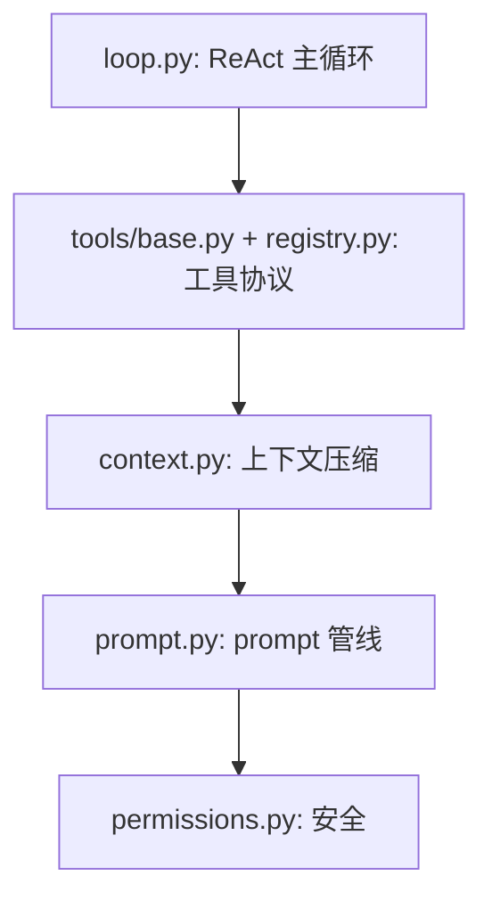
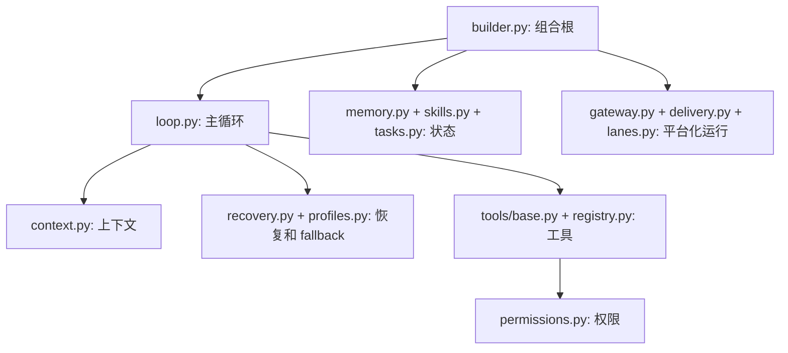

# 04 - 关键源码导读

## 1. 面试时最值得打开的 8 个文件

### 1. `src/agent/core/loop.py`

为什么重要：这是 Agent 心脏。面试官最关心“你的 Agent 到底怎么跑起来”。

建议展示：

- `run_task()` 函数签名：依赖注入清晰。
- 恢复 session 历史。
- `ContextGuard.prepare()`。
- `ResilienceRunner.run()`。
- tool call 循环。
- hook 和 session append。

面试讲法：

> 这个文件展示了完整 ReAct loop。它本身不关心 Telegram、MCP、具体模型供应商，只依赖抽象的 `ModelClient` 和 `ToolRegistry`。所以核心 loop 可以被 CLI、Gateway、Cron、Subagent 复用。

### 2. `src/agent/core/context.py`

为什么重要：上下文管理是 Coding Agent 最容易被追问的模块。

建议展示：

- `prepare()`。
- `truncate_large_tool_results()`。
- `compact_history()`。
- `_safe_split_index()`。
- `_llm_summarize()` 和 `_mechanical_summary()`。

面试讲法：

> 我把上下文管理拆成轻量截断和重量 compact。每轮都会截断超大工具结果，但只有超过 token budget 才总结旧历史。`_safe_split_index` 是关键细节，避免切断 assistant tool call 与 tool result。

### 3. `src/agent/prompt.py`

为什么重要：prompt 工程经常被讲得很玄，这个文件能体现工程化拆分。

建议展示：

- `SystemPromptBuilder.sections()`。
- section 顺序。
- `_tools_block()`。
- `_memory_block()`。
- `_runtime_block()`。

面试讲法：

> 我没有把 system prompt 当一个大字符串，而是分 section 管线组装。稳定内容放前面，动态内容放后面，兼顾可维护性和 prompt cache。

### 4. `src/agent/tools/base.py` + `src/agent/tools/registry.py`

为什么重要：工具系统决定 Agent 能做什么，也体现类型设计。

建议展示：

- `Tool.schema()` 里 `input_model.model_json_schema()`。
- `Tool.execute()` 里 Pydantic 参数验证。
- `ToolRegistry.execute()` 中未知工具、权限检查、ValidationError、异常包装。

面试讲法：

> 新增工具只要声明 Pydantic input model 并实现 `run()`。模型看到的是 JSON Schema，运行时拿到的是验证后的 Python 对象，错误不会炸掉主循环，而是回写成 ToolResult。

### 5. `src/agent/permissions.py`

为什么重要：Coding Agent 的安全性是高频追问。

建议展示：

- `PermissionRule.matches()`。
- `PermissionManager.decide()` 三层判断。
- dangerous bash patterns。
- sensitive paths。
- memory_append 默认 ask。

面试讲法：

> 我做的是应用层权限，不是 OS 沙箱。它分成工具级策略、配置规则和内置安全兜底，结果是 allow/deny/ask 三态。这个模型可解释，也容易扩展到不同通道的审批。

### 6. `src/agent/channels/delivery.py`

为什么重要：可靠投递能体现后端工程能力。

建议展示：

- `DeliveryEntry`。
- `enqueue()`。
- `_atomic_write()`。
- `mark_sent()` / `mark_retry()` / `mark_failed()`。
- `DeliveryRunner.deliver()`。
- `chunk_message()`。

面试讲法：

> 这是文件系统版 WAL。先把待投递消息写到 queued，再发送，成功后移动到 sent，失败则带 next_retry_at 重试。不能保证 exactly-once，但能显著降低丢消息风险。

### 7. `src/agent/scheduling/lanes.py`

为什么重要：并发控制是区分 demo 和 runtime 的关键。

建议展示：

- `LANE_PRIORITIES`。
- `submit()`。
- `run()` 中 ContextVar 内联执行。
- `_execute_job()` 记录 history。

面试讲法：

> main、subagent、cron、heartbeat 都可能触发 LLM 调用。我用优先级队列和单 worker 做协作式调度，保证用户消息优先。ContextVar 解决 worker 内嵌套调用自己导致的死锁。

### 8. `src/agent/runtime/builder.py`

为什么重要：这里能说明项目不是一堆散模块，而是有清楚的装配边界。

建议展示：

- `_build_runtime()`。
- `_build_model_client()`。
- `_attach_mcp_tools()`。
- `_refresh_system_prompt()`。
- `_run_agent_text()`。

面试讲法：

> builder 是唯一组合根，负责把状态、prompt、权限、工具、插件、MCP、hook、context、model、session 组装起来。核心模块不自己 new 依赖，所以测试和替换都容易。

## 2. 第二梯队源码

| 文件 | 什么时候展示 | 展示重点 |
|---|---|---|
| `src/agent/core/recovery.py` | 被问 API 失败怎么处理 | classify_error、RecoveryBudget、ResilienceRunner |
| `src/agent/profiles.py` | 被问多模型/多 key | ProfileManager cooldown、FallbackModelClient |
| `src/agent/state/memory.py` | 被问记忆系统 | Markdown/frontmatter、atomic write、render_for_prompt |
| `src/agent/state/sessions.py` | 被问持久化 | JSONL append、flock、rebuild_messages |
| `src/agent/state/tasks.py` | 被问任务系统 | blocked_by DAG、complete 解锁 |
| `src/agent/state/skills.py` | 被问技能加载 | render_index + load 全文 |
| `src/agent/channels/gateway.py` | 被问多通道 | BindingTable、DMScope、handle_inbound |
| `src/agent/agents/subagent.py` | 被问子代理 | session 隔离、depth、lane |
| `src/agent/agents/team.py` | 被问多 agent 协作 | MessageBus、Future 配对 |
| `src/agent/mcp/router.py` | 被问 MCP | MCPProxyTool、工具命名、注册进 ToolRegistry |

## 3. 可以用伪代码讲的模块

这些模块不建议面试时打开源码，除非面试官追问：

- `channels/telegram.py`：重点是平台适配，不是 Agent 核心。
- `channels/feishu.py`：同上。
- `tools/read.py` / `write.py` / `edit.py` / `grep.py`：常规工具实现，讲 Tool 抽象即可。
- `config.py`：配置合并重要，但源码细节不如核心 loop 有价值。
- `plugins.py`：讲 plugin 工具注册流程即可。
- `hooks.py`：可以讲 subprocess + JSON stdin/stdout，不一定看完整代码。

## 4. 面试源码展示路线

### 10 分钟版本

讲完这 5 个文件，面试官会知道你理解 Agent 的核心。

### 20 分钟版本

讲完这个版本，可以体现完整 runtime 能力。

### 40 分钟版本

增加：

- `subagent.py`：上下文隔离。
- `team.py`：多 agent 消息总线。
- `mcp/router.py`：外部协议接入。
- `worktree.py`：隔离工作区。

这个版本适合系统设计面。

## 5. 源码讲解中的注意点

### 不要过度展示工具细节

读写文件、grep、bash 的实现不是重点。重点是：

- 工具如何注册。
- schema 如何生成。
- 参数如何验证。
- 权限如何裁决。
- 错误如何返回模型。

### 主动承认边界

如果面试官问安全：

> 我这里没有实现 Codex 那样的 OS 沙箱，所以不会说它能防住所有恶意命令。我的目标是应用层权限和审批链路。生产环境可以在这个基础上把 tool execution 放进 container 或 seccomp/landlock 沙箱。

如果问规模：

> 文件系统持久化适合单机 Coding Agent。如果要做多租户服务，SessionStore、DeliveryQueue、TaskStore 都可以替换成数据库/Redis，但接口边界已经拆出来了。

### 把代码和设计取舍连起来

不要只说“这里用了 Pydantic”。要说：

> Pydantic 同时解决了参数验证、JSON Schema、序列化和错误隔离，所以适合工具系统。

不要只说“这里用了 asyncio”。要说：

> LLM、外部通道、MCP、定时任务都是 IO 密集型，asyncio 能用较低复杂度处理并发；LaneScheduler 则控制并发进入 LLM 的顺序。

