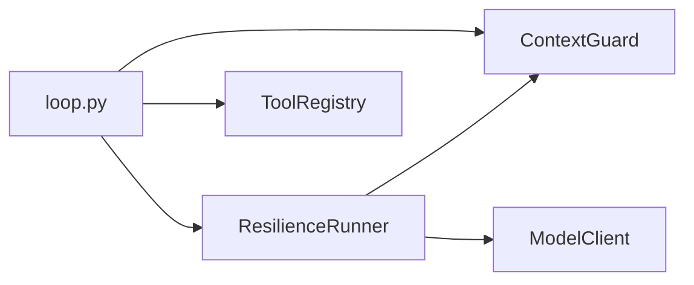
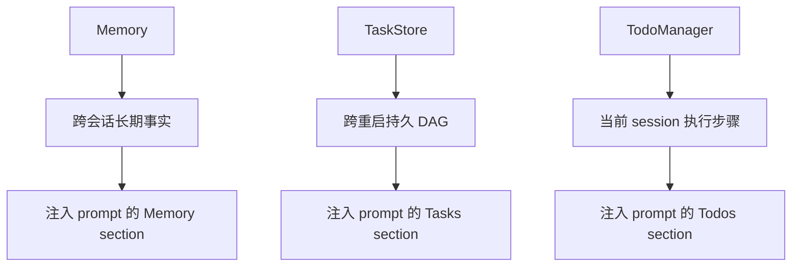
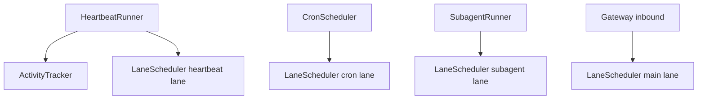
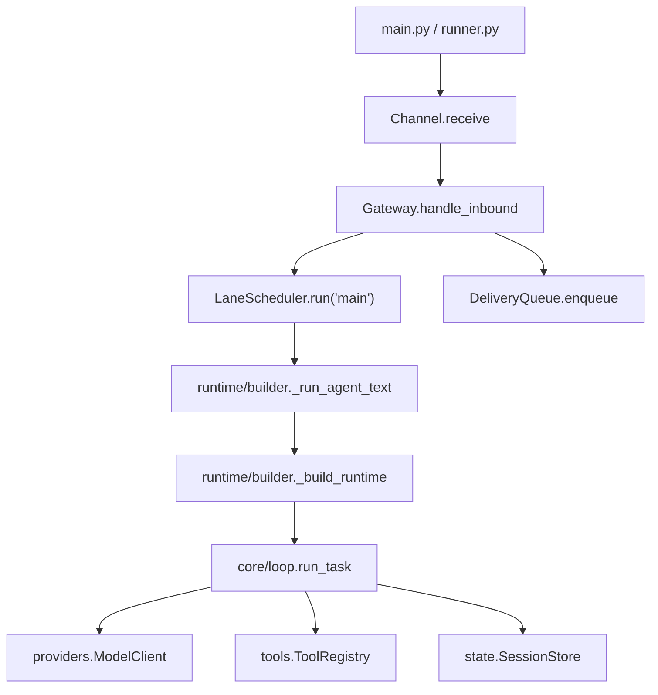

# 06 - 全模块清单

> 目标：面试官如果要求“按模块介绍项目”，可以用这份清单从顶层到源码逐层说明。

## 1. 顶层模块

| 模块 | 职责 | 面试价值 | 是否重点看源码 |
|---|---|---|---|
| `main.py` | Typer CLI 入口，解析命令行参数 | 说明用户如何启动 agent | 低 |
| `config.py` | `AgentSettings` 和配置加载，支持 CLI/项目/用户配置合并 | 说明配置分层和运行时可调参数 | 中 |
| `models.py` | Pydantic 数据模型：Message、ToolCall、ToolResult、ModelTurn、RuntimeConfig 等 | 说明系统契约和类型安全 | 中 |
| `errors.py` | Agent 异常层级 | 说明错误语义分类 | 低 |
| `prompt.py` | System Prompt 管线式组装 | 高价值，体现 prompt 工程化 | 高 |
| `permissions.py` | 工具权限规则引擎 | 高价值，安全必问 | 高 |
| `hooks.py` | pre/post tool hook，外部脚本扩展 | 说明运行时扩展点 | 中 |
| `profiles.py` | 多模型 profile、cooldown、fallback | 说明供应商无关和恢复策略 | 高 |
| `plugins.py` | 发现 `plugin.json` 并注册命令型插件工具 | 说明插件扩展 | 中 |

## 2. `core/`：Agent 核心

| 文件 | 职责 | 面试讲法 | 是否重点 |
|---|---|---|---|
| `core/loop.py` | ReAct 主循环，驱动模型和工具 | Agent 心脏：上下文 -> 模型 -> 工具 -> 回写 -> 循环 | 必看 |
| `core/context.py` | token 预算、工具结果截断、历史 compact | 长任务如何不爆上下文 | 必看 |
| `core/recovery.py` | LLM 错误分类和有界恢复 | 限流、溢出、截断、超时分别处理 | 必看 |

关系图：

## 3. `tools/`：内置工具体系

| 文件 | 职责 | 面试讲法 | 是否重点 |
|---|---|---|---|
| `tools/base.py` | Tool 抽象，Pydantic schema 生成 | 新增工具的统一接口 | 必看 |
| `tools/registry.py` | 工具注册、权限检查、异常包装 | 工具执行中心 | 必看 |
| `tools/bash.py` | 执行 shell 命令 | 高风险工具，配合权限讲 | 中 |
| `tools/read.py` | 读取文件，支持范围读取 | 常规只读工具 | 低 |
| `tools/write.py` | 写文件 | 副作用工具，配合权限讲 | 中 |
| `tools/edit.py` | 精确编辑文件 | Coding Agent 核心工具之一 | 中 |
| `tools/grep.py` | 搜索文件内容 | 只读检索工具 | 低 |
| `tools/memory.py` | 记忆追加/保存工具 | 连接工具系统和记忆系统 | 中 |
| `tools/skill.py` | `load_skill` 工具 | 两层技能加载的执行入口 | 中 |
| `tools/tasks.py` | task_create/complete/list | 持久 DAG 任务入口 | 中 |
| `tools/todo.py` | todo 写入工具 | 短期计划入口 | 低 |
| `tools/subagent.py` | 调用子代理 | 多代理委派入口 | 中 |
| `tools/worktree.py` | 创建/清理 worktree | 并行修改隔离入口 | 中 |

## 4. `state/`：文件持久化状态

| 文件 | 职责 | 面试讲法 | 是否重点 |
|---|---|---|---|
| `state/sessions.py` | JSONL 会话历史，支持重启恢复 | append-only 历史和 session 隔离 | 必看 |
| `state/memory.py` | Markdown/frontmatter 长期记忆 | 跨会话偏好和项目事实 | 必看 |
| `state/memory_search.py` | 混合记忆搜索：关键词、向量占位、融合、时间衰减、MMR | 可作为扩展亮点 | 中 |
| `state/skills.py` | 技能索引和按需加载 | prompt 只放索引，全文按需读取 | 高 |
| `state/tasks.py` | JSON 文件 DAG 任务系统 | blocked_by 依赖和解锁 | 高 |
| `state/todo.py` | session 级 todo 持久化 | 当前任务短期计划 | 中 |

### Memory、Task、Todo 的边界

## 5. `runtime/`：装配与运行

| 文件 | 职责 | 面试讲法 | 是否重点 |
|---|---|---|---|
| `runtime/builder.py` | 组合根，创建 memory、tools、prompt、model、session 等依赖 | 说明系统如何从配置组装成可运行 agent | 必看 |
| `runtime/runner.py` | CLI once/repl/watch/channel loop 的运行模式 | 说明入口如何调用 runtime | 中 |
| `runtime/infra.py` | 运行时基础设施辅助组装 | 可略讲 | 低 |
| `runtime/utils.py` | console、路径解析、审批 prompt、流式打印 | 辅助函数 | 低 |

## 6. `providers/`：模型抽象

| 文件 | 职责 | 面试讲法 | 是否重点 |
|---|---|---|---|
| `providers/base.py` | `ModelClient` Protocol 和 stream handler 类型 | 上层不绑定 litellm | 中 |
| `providers/litellm_client.py` | litellm 实现，处理 streaming 和 tool calls | 多供应商模型适配 | 必看 |

面试重点：

- `ModelClient` 是抽象边界。
- `LiteLLMModelClient` 把本项目 `Message` 转成 litellm payload。
- streaming 时要累积分片 tool call arguments。

## 7. `channels/`：多通道接入与投递

| 文件 | 职责 | 面试讲法 | 是否重点 |
|---|---|---|---|
| `channels/base.py` | `InboundMessage`、Channel 抽象、ChannelManager | 平台无关消息模型 | 中 |
| `channels/cli.py` | CLI 通道 | 本地入口适配 | 低 |
| `channels/telegram.py` | Telegram Bot API 适配 | 外部通道例子 | 低 |
| `channels/feishu.py` | 飞书 webhook/API 适配 | 企业 IM 接入例子 | 低 |
| `channels/gateway.py` | Gateway、BindingTable、DMScope session key | 多通道路由核心 | 必看 |
| `channels/delivery.py` | WAL 风格可靠投递队列 | 不丢回复、重试、分片 | 必看 |

## 8. `scheduling/`：主动任务与优先级调度

| 文件 | 职责 | 面试讲法 | 是否重点 |
|---|---|---|---|
| `scheduling/lanes.py` | main/subagent/cron/heartbeat 优先级调度 | 并发控制和死锁规避 | 必看 |
| `scheduling/activity.py` | 用户活跃状态追踪 | 心跳不打断用户对话 | 中 |
| `scheduling/heartbeat.py` | 主动心跳 runner | Agent 主动跟进 | 中 |
| `scheduling/cron.py` | at/every/cron 定时任务 | 定时执行 agent turn | 中 |
| `scheduling/background.py` | 后台任务管理 | 统一 create_task 和结果队列 | 中 |

关系图：

## 9. `agents/`：多代理与隔离

| 文件 | 职责 | 面试讲法 | 是否重点 |
|---|---|---|---|
| `agents/subagent.py` | 子代理运行器，独立 session、depth 限制 | 主代理委派和上下文隔离 | 必看 |
| `agents/team.py` | MessageBus、TeamMember、Team | 多 agent request/response/broadcast | 高 |
| `agents/worktree.py` | git worktree 隔离 | 多 agent 并行改代码的隔离基础 | 中 |

## 10. `mcp/`：外部工具协议

| 文件 | 职责 | 面试讲法 | 是否重点 |
|---|---|---|---|
| `mcp/client.py` | stdio MCP client，官方 SDK 封装 | 协议连接层 | 中 |
| `mcp/router.py` | MCP 工具发现、命名、代理调用 | 外部工具接入 ToolRegistry | 必看 |

## 11. `channels`、`runtime`、`core` 的调用关系

## 12. 面试中如何按模块讲

推荐顺序：

1. 先讲 `core`：Agent 为什么能做事。
2. 再讲 `tools`：模型怎么调用外部能力。
3. 再讲 `state`：如何跨轮次、跨重启、跨会话保留信息。
4. 再讲 `prompt/context/recovery`：如何把长任务做稳。
5. 再讲 `permissions/hooks`：如何控制副作用。
6. 再讲 `channels/delivery/scheduling`：如何从 CLI demo 变成 runtime。
7. 最后讲 `subagent/team/mcp/plugin/worktree`：如何扩展到复杂任务。

一句话总结：

> `core` 让 Agent 会思考和行动，`tools` 给它行动能力，`state` 给它记忆，`context/prompt/recovery` 让它能长时间稳定工作，`permissions/hooks` 控制风险，`gateway/delivery/scheduling` 把它平台化，`subagent/team/mcp/plugin/worktree` 把它扩展成可协作的 coding runtime。

