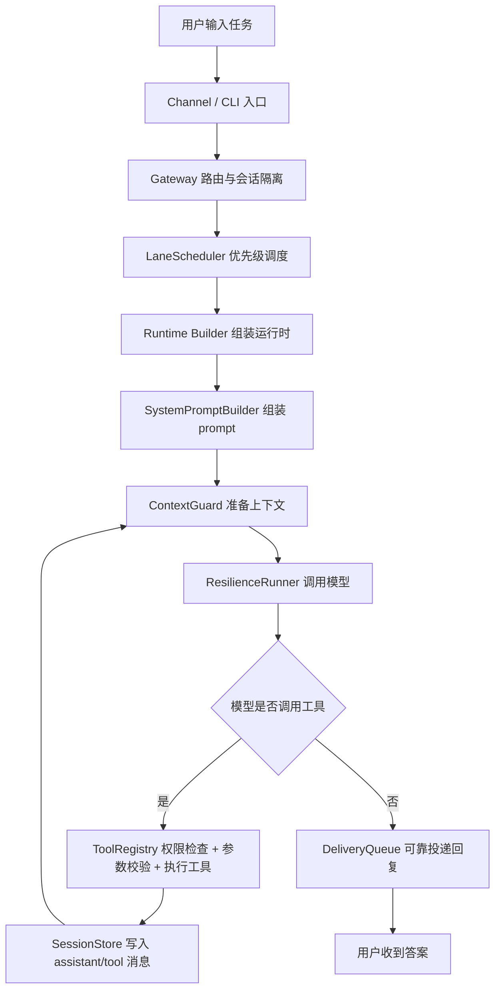

# Agent Deep Dive 面试手册

> 目标：把本项目包装成可以在面试中讲清楚、讲深入、讲出技术判断力的项目材料。

本目录不是简单的项目说明，而是面试视角的讲稿和源码导读。建议面试前按顺序阅读：

1. [01-项目总览与数据流.md](./01-项目总览与数据流.md)
   - 先建立整体架构图。
   - 重点准备“一条消息从进入系统到最终回复”的完整链路。
2. [02-核心模块逐个击破.md](./02-核心模块逐个击破.md)
   - 每个模块说明：解决什么问题、怎么实现、为什么这样做、面试官可能追问什么。
   - 覆盖记忆系统、上下文管理、prompt 组装、工具系统、权限、调度、可靠投递、MCP、子代理等。
3. [03-ClaudeCode-Codex-本项目横向对比.md](./03-ClaudeCode-Codex-本项目横向对比.md)
   - 横向比较 Claude Code、OpenAI Codex 和本项目。
   - 重点用于回答“你为什么这么设计，而不是照搬某个成熟产品”。
4. [04-关键源码导读.md](./04-关键源码导读.md)
   - 列出真正值得给面试官看的源码。
   - 其他模块给伪代码即可，不浪费面试时间。
5. [05-高频面试问答.md](./05-高频面试问答.md)
   - 按真实追问风格准备回答。
   - 可直接用于背诵或改写成简历 bullet。
6. [06-全模块清单.md](./06-全模块清单.md)
   - 覆盖 `src/agent` 下每个模块。
   - 说明职责、面试价值、是否值得打开源码。

## 60 秒项目介绍

我做了一个本地 Coding Agent 框架，参考 Claude Code 和 OpenAI Codex CLI 的核心机制，用 Python 从零实现了一个能完成编程任务的 AI Agent。

核心是 ReAct 主循环：用户输入任务后，模型可以反复调用工具，例如读文件、搜索代码、写文件、执行命令、管理 todo、加载技能、调用子代理和 MCP 外部工具。每轮工具结果都会写回上下文，再继续让模型推理，直到模型不再调用工具并给出最终答案。

工程上，我不只实现了最小 agent loop，还补齐了生产化能力：会话 JSONL 持久化、上下文压缩、记忆系统、prompt 管线、权限审批、hook 扩展、多模型 fallback、Telegram/飞书网关、可靠投递队列、优先级调度、heartbeat/cron、子代理、团队协作、worktree 隔离、MCP 和插件系统。

技术栈是 `Python 3.11+`、`asyncio`、`Pydantic v2`、`litellm`、`typer`、`rich`、`mcp`，尽量用文件系统持久化，避免 Redis/数据库依赖，适合单机本地 Coding Agent 场景。

## 面试讲解主线

这条主线可以覆盖大多数面试问题：

- 问架构：讲入口、网关、调度、运行时、核心 loop、工具、状态、投递。
- 问 Agent 原理：讲 ReAct 循环和 tool call 回写。
- 问工程化：讲持久化、上下文压缩、权限、恢复、调度、可靠投递。
- 问技术选型：讲 Python/asyncio/Pydantic/litellm/文件系统的取舍。
- 问对比：讲 Claude Code 偏交互与生态、Codex 偏沙箱与审批、本项目偏教学可解释和单机可落地。

## 模块索引

| 模块 | 关键源码 | 面试价值 |
|---|---|---|
| ReAct 主循环 | `src/agent/core/loop.py` | 说明 Agent 如何从 LLM 变成能做事的系统 |
| 上下文管理 | `src/agent/core/context.py` | 说明长对话、token 预算、compact |
| Prompt 组装 | `src/agent/prompt.py` | 说明稳定/动态信息分层和 prompt cache 思维 |
| 记忆系统 | `src/agent/state/memory.py` | 说明跨会话记忆、人类可读存储 |
| 工具系统 | `src/agent/tools/base.py`, `src/agent/tools/registry.py` | 说明 Pydantic schema、权限和错误包装 |
| 权限系统 | `src/agent/permissions.py` | 说明 allow/deny/ask 和安全兜底 |
| 错误恢复 | `src/agent/core/recovery.py` | 说明限流、溢出、截断、超时分类恢复 |
| 会话持久化 | `src/agent/state/sessions.py` | 说明 JSONL 历史恢复 |
| 网关路由 | `src/agent/channels/gateway.py` | 说明多通道、多用户、会话隔离 |
| 可靠投递 | `src/agent/channels/delivery.py` | 说明 WAL 思想、重试、幂等风险 |
| 调度系统 | `src/agent/scheduling/lanes.py` | 说明优先级、保序、死锁规避 |
| 子代理 | `src/agent/agents/subagent.py` | 说明上下文隔离和递归深度控制 |
| Team | `src/agent/agents/team.py` | 说明多 agent request/response 配对 |
| MCP | `src/agent/mcp/router.py` | 说明外部工具协议如何接入内置工具体系 |
| 多模型 fallback | `src/agent/profiles.py` | 说明供应商无关和可恢复失败切换 |
